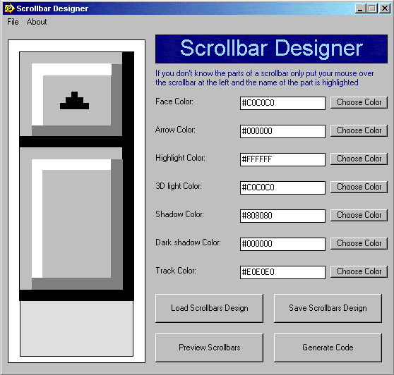



## Web Scrollbar Designer

### Description

Scrollbar Designer, Updated Version

This is the Web Scrollbar Designer VB program, with this you can design stylish and modern web scrollbars for your web pages, only select the colors and generate the code, also you can export the Scrollbar Design to a CSS or HTML file.

Please vote and leave your comments.
 
### More Info
 

             |
---                |---
**Submitted On**   |2002-09-06 00:29:04
**By**             |[Design7 Software](https://github.com/Planet-Source-Code/PSCIndex/blob/master/ByAuthor/design7-software.md)
**Level**          |Intermediate
**User Rating**    |4.6 (23 globes from 5 users)
**Compatibility**  |VB 5\.0, VB 6\.0
**Category**       |[Complete Applications](https://github.com/Planet-Source-Code/PSCIndex/blob/master/ByCategory/complete-applications__1-27.md)
**World**          |[Visual Basic](https://github.com/Planet-Source-Code/PSCIndex/blob/master/ByWorld/visual-basic.md)
**Archive File**   |[Web\_Scroll127448962002\.zip](https://github.com/Planet-Source-Code/design7-software-web-scrollbar-designer__1-38536/archive/master.zip)

